# HPC Laboratory Work №4: Salt and Pepper
# Assignment
Given the image of size M×N with "Salt and Pepper" noise, implement and apply a CUDA version of 9-point
median filter and store the result to output image. Missing values for edge rows and columns are to be taken from
nearest pixels.

# Tools 
Programming language: Python v3.7.12 
IDE: Google Colaboratory 
GPU: Tesla K80 
CPU: Intel(R) Xeon(R) CPU @ 2.30GHz

# Experiments

## Image 1
This image has 91908 elements
|Original Image | Salt and Paper | CPU filtering | GPU filtering | 
|:----:|:----:|:----:|:----:|
| | 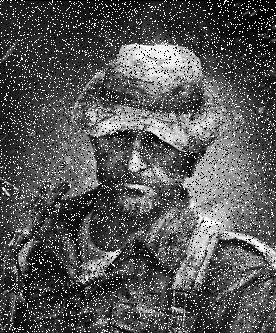 | 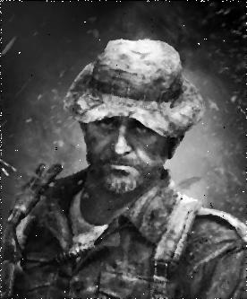 |  | 
| --- | --- | 1.3400 seconds | 0.0008 seconds | 

## Image 2
This image has 172800 elements
|Original Image | Salt and Paper | CPU filtering | GPU filtering | 
|:----:|:----:|:----:|:----:|
| | 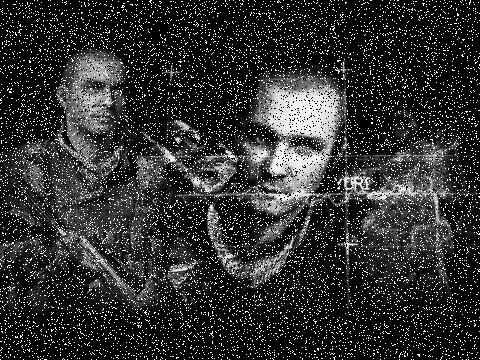 | 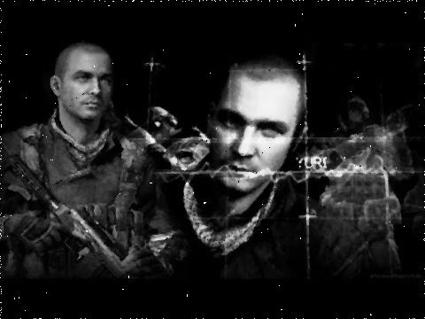 |  | 
| --- | --- | 2.3731 seconds | 0.0011 seconds | 

## Image 3
This image has 810000 elements
|Original Image | Salt and Paper | CPU filtering | GPU filtering | 
|:----:|:----:|:----:|:----:|
| | 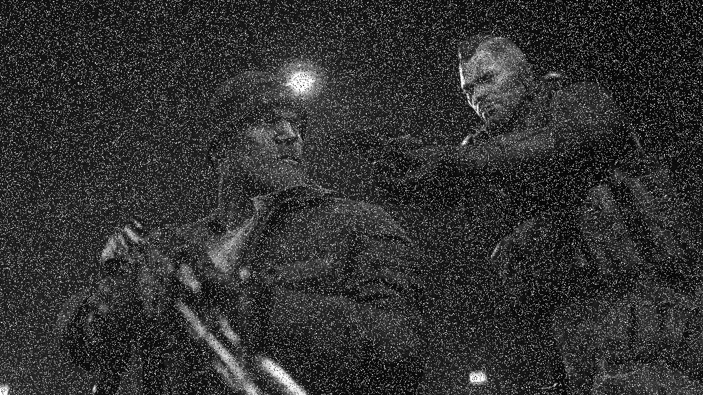 |  | 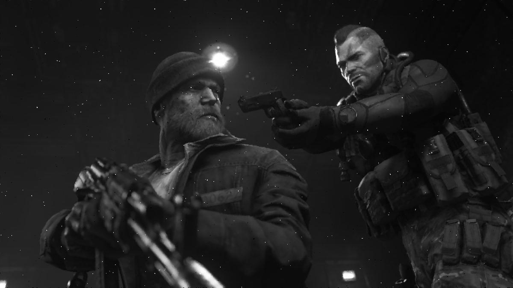 | 
| --- | --- | 11.2826 seconds | 0.0032 seconds | 

## Image 4
This image has 1047552 elements
|Original Image | Salt and Paper | CPU filtering | GPU filtering | 
|:----:|:----:|:----:|:----:|
|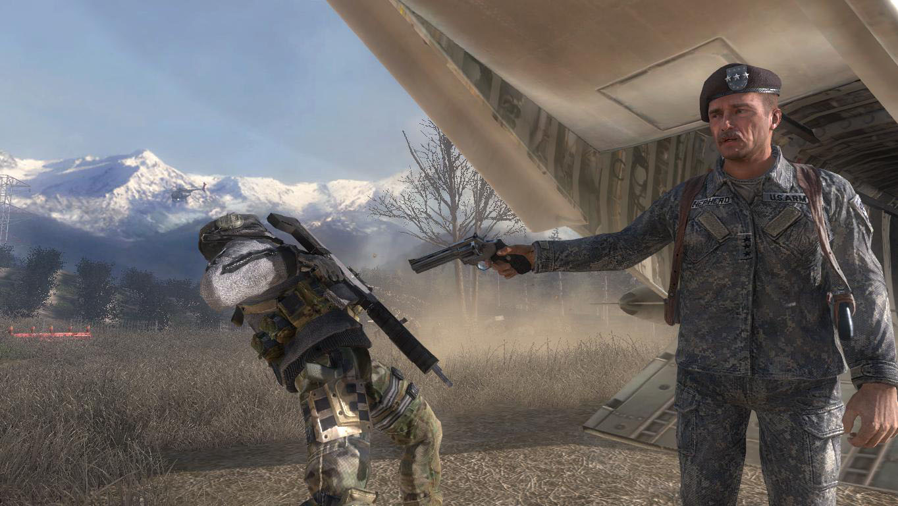 |  | 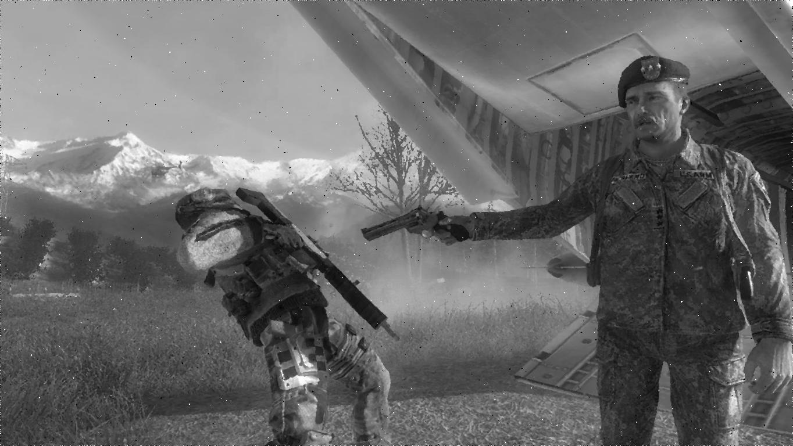 |  | 
| --- | --- | 15.1601 seconds | 0.0037 seconds | 

## Image 5
This image has 2073600 elements
|Original Image | Salt and Paper | CPU filtering | GPU filtering | 
|:----:|:----:|:----:|:----:|
|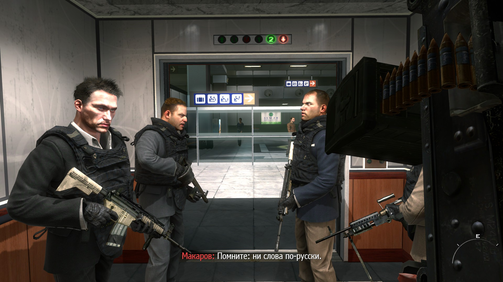 | 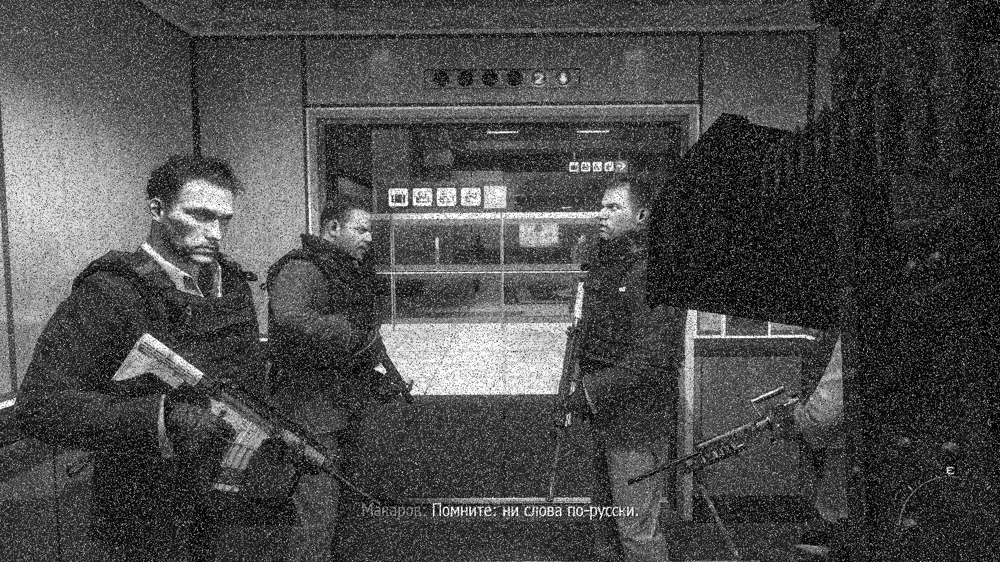 |  | 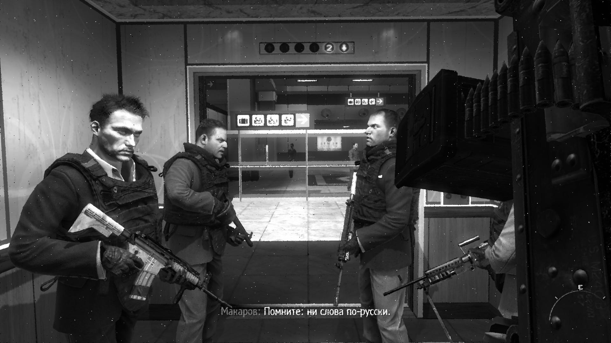 | 
| --- | --- | 29.0027 seconds | 0.0072 seconds |   

# Results

| Original Image | CPU filtering | GPU filtering | Boost
|:----:|:----:|:----:| :----:|
| Image 1 | 1.3400 seconds | 0.0008 seconds | 1578.8294 |
| Image 2 | 2.3731 seconds | 0.0011 seconds | 2144.7138 |
| Image 3 | 11.2826 seconds | 0.0032 seconds | 3518.1529 |
| Image 4 | 15.1601 seconds | 0.0037 seconds | 3997.1175 |
| Image 5 | 29.0027 seconds | 0.0072 seconds | 4004.4172 |

# Conclusion
Based on the temporal performance of the algorithms, as well as the acceleration rate, 
it becomes obvious that the use of GPU for filtering is completely justified, 
especially in the case of an increased image resolution with a large number of elements in the image.
